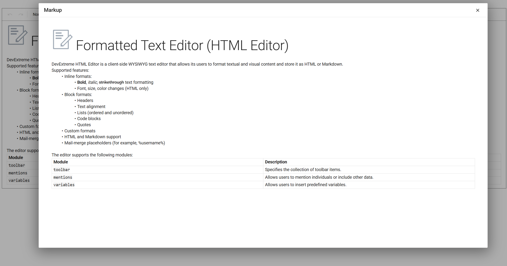

<!-- default badges list -->

<!-- default badges end -->
# DevExtreme HTML Editor - Preserve Styles in Print Preview

This example demonstrates how to show DevExtreme HTML Editor content in a preview popup and preserve the editor's styles in the generated preview document.

The preview implementation:
- Reads the current markup from the embedded Quill instance
- Recreates the HTML Editor content structure in a standalone document
- Copies DevExtreme theme styles to keep the preview appearance consistent with the editor
- Uses an iframe-based preview that can be used for print scenarios

The repository includes this scenario for Angular, React, Vue, jQuery, and ASP.NET Core.

## Files to Review

- **Angular**
	- [app.component.html](Angular/src/app/app.component.html)
	- [app.component.ts](Angular/src/app/app.component.ts)
	- [html-preview-helper.ts](Angular/src/app/helpers/html-preview-helper.ts)
- **React**
	- [App.tsx](React/src/App.tsx)
	- [PreviewIframe.tsx](React/src/htmleditor-preview/PreviewIframe.tsx)
	- [useHtmlEditorPreview.ts](React/src/htmleditor-preview/hooks/useHtmlEditorPreview.ts)
- **Vue**
	- [App.vue](Vue/src/App.vue)
	- [HomeContent.vue](Vue/src/components/home/HomeContent.vue)
	- [helpers.ts](Vue/src/components/home/helpers.ts)
- **jQuery**
	- [index.html](jQuery/src/index.html)
	- [index.js](jQuery/src/index.js)
	- [helpers.js](jQuery/src/helpers.js)
- **ASP.NET Core**
	- [Index.cshtml](ASP.NET%20Core/Views/Home/Index.cshtml)
	- [helpers.js](ASP.NET%20Core/wwwroot/js/helpers.js)

## Documentation

- [HTML Editor Overview](https://js.devexpress.com/Documentation/Guide/UI_Components/HtmlEditor/Overview/)
- [Popup Overview](https://js.devexpress.com/Documentation/Guide/UI_Components/Popup/Overview/)
- [Angular HTML Editor Documentation](https://js.devexpress.com/Angular/Documentation/Guide/UI_Components/HtmlEditor/Getting_Started_with_HtmlEditor/)
- [React HTML Editor Documentation](https://js.devexpress.com/React/Documentation/Guide/UI_Components/HtmlEditor/Getting_Started_with_HtmlEditor/)
- [Vue HTML Editor Documentation](https://js.devexpress.com/Vue/Documentation/Guide/UI_Components/HtmlEditor/Getting_Started_with_HtmlEditor/)
- [jQuery HTML Editor Documentation](https://js.devexpress.com/jQuery/Documentation/Guide/UI_Components/HtmlEditor/Getting_Started_with_HtmlEditor/)
- [ASP.NET Core HTML Editor Documentation](https://docs.devexpress.com/AspNetCore/401367/devextreme-based-controls/controls/html-editor)
<!-- feedback -->
## Does This Example Address Your Development Requirements/Objectives?

 

(you will be redirected to DevExpress.com to submit your response)
<!-- feedback end -->
